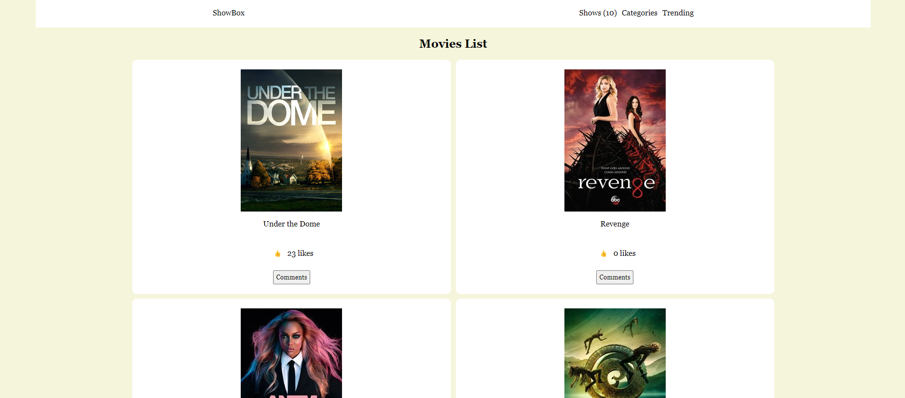

<a name="readme-top"></a>
<div align="center">

  
  <br/>

  <h3><b>App UI Sample</b></h3>

</div>
# 🚀 Live Demo:
- https://bill7pearl.github.io/JS_Capstone/

# Presentation Video:
- https://www.loom.com/share/315d572fbbef46fc89fb85875c0b75fb

- [📗 Table of Contents](#-table-of-contents)
- [📖 Todo LIst ](#-Capstone-JS-)
  - [🛠 Built With ](#-built-with-)
    - [Tech Stack ](#tech-stack-)
    - [Key Features ](#key-features-)
  - [🚀 Live Demo ](#-live-demo-)
  - [💻 Getting Started ](#-getting-started-)
    - [Prerequisites](#prerequisites)
    - [Setup](#setup)
    - [Install](#install)
    - [Usage](#usage)
  - [👥 Author ](#-author-)
  - [🔭 Future Features ](#-future-features-)
  - [🤝 Contributing ](#-contributing-)
  - [⭐️ Show your support ](#️-show-your-support-)
  - [🙏 Acknowledgments ](#-acknowledgments-)
  - [📝 License ](#-license-)

# 📖 JS Capstone <a name="about-project"></a>
> This is the 2nd Casptone project of Microverse curriculum built collaboratively.
> **JS Capstone** is a Javascript application that fetches movies using an external API and pouplate them in the DOM.

## 🛠 Built With <a name="built-with"></a>
- HTML.
- CSS.
- Javascript.
- TvMazeAPI.

### Tech Stack <a name="tech-stack"></a>
- Javascript modules and ES6.
- API.
- Webpack.

### Key Features <a name="key-features"></a>
> Some key feature of this project:
- **User can comment and like a movie**
- **User can browse a list of movies and read its description**

<p align="right">(<a href="#readme-top">back to top</a>)</p>

## 🚀 Live Demo <a name="live-demo"></a>
- [Live Demo Link](https://bill7pearl.github.io/JS_Capstone/)

## 🚀 Presentation video <a name="presentation-video"></a>
- [Presentation Video Link](https://www.loom.com/share/315d572fbbef46fc89fb85875c0b75fb)

<p align="right">(<a href="#readme-top">back to top</a>)</p>

## 💻 Getting Started <a name="getting-started"></a>
>Please follow the instructions to clone my repo
To get a local copy, follow these simple example steps.
Clone this repository or download the Zip folder:

### Prerequisites
>Inorder to check the linters errors make sure you have installed the [nodejs](https://nodejs.org)

### Setup
>Clone this repository to your desired folder: cd [folder] to navigate and run the below comand to clone the project
```sh
git clone https://github.com/bill7pearl/Capstone-JS.git
```

### Install
Install this project with:
- download npm the packages
```sh
npm install --save-dev
```

### Usage
 > To see the project in your local browser first of all, go to the dist folder then open the index.html file.

<p align="right">(<a href="#readme-top">back to top</a>)</p>

## 👥 Author <a name="authors"></a>
👤 **Billal Chami**
- GitHub: [@githubhandle](https://github.com/bill7pearl)
- Twitter: [@twitterhandle](https://twitter.com/BillChami)
- LinkedIn: [LinkedIn](https://www.linkedin.com/in/billal-chami-263497194/)
👤 **Patrick Mukula**
- GitHub: [@githubhandle](https://github.com/Patfarmurs)
- Twitter: [@twitterhandle](https://twitter.com/MukulayengeP)
- LinkedIn: [LinkedIn](https://www.linkedin.com/in/patrick-m-5601831a1/)

<p align="right">(<a href="#readme-top">back to top</a>)</p>

## 🔭 Future Features <a name="future-features"></a>
- [ ] **We will add some awesome UX & UI features**
- [ ] **We will add more functionality using javascript and implement backend**

<p align="right">(<a href="#readme-top">back to top</a>)</p>
## 🤝 Contributing <a name="contributing"></a>
Contributions, issues, and feature requests are welcome!
Feel free to check the [issues page](../../issues/).

<p align="right">(<a href="#readme-top">back to top</a>)</p>

# 📝 License:
This project is MIT licensed.
